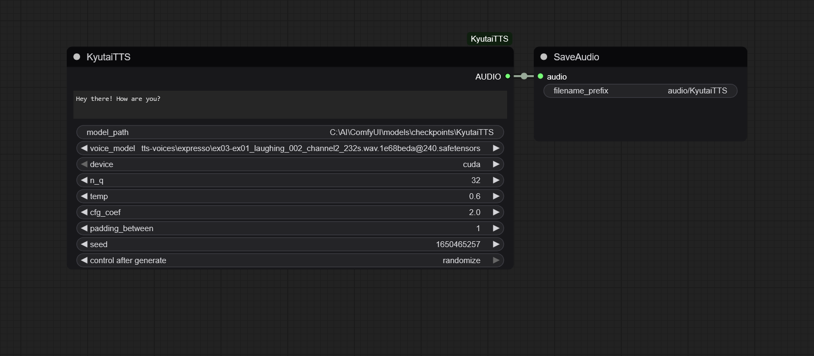

# ComfyUI-KyutaiTTS


A custom node for ComfyUI that allows TTS generation with the [Kyutai TTS 1.6b en_fr model](https://huggingface.co/kyutai/tts-1.6b-en_fr) using [Kyutai offered voice models.](https://huggingface.co/kyutai/tts-voices)
The model's intended use is [https://github.com/kyutai-labs/delayed-streams-modeling](https://github.com/kyutai-labs/delayed-streams-modeling)which is not implemented here.
I made this version as it can generate large ammounts quickly and at acceptable quality for my use cases.
The model outputs at 24000Hz, some post processing can improve it if needed.

## Features

*   **Text-to-Speech Generation:** Convert input text into spoken audio.
*   **Model Selection:** Enter path to the Kyutai TTS model directory.
*   **Voice Model Support:** Utilize various voice models (checkpoints) to customize the generated voice.
*   **Device Selection:** Choose between CPU and CUDA (GPU) for processing, leveraging GPU acceleration for faster generation.
*   **Adjustable Parameters:** Fine-tune speech generation with parameters such as:
    *   `n_q`: Number of quantization levels.
    *   `temp`: Sampling temperature for speech variability.
    *   `cfg_coef`: Classifier-free guidance coefficient for adherence to input.
    *   `padding_between`: Control silence between speech segments.
    *   `seed`: For reproducible audio generation.

## Installation

1.  **Clone this Repository and install requirements:**
    ```bash
    cd ComfyUI/custom_nodes
    git clone https://github.com/BobRandomNumber/ComfyUI-KyutaiTTS.git
    pip install -r requirements.txt
    ```

2.  **Download Model Files:**

    *   **Kyutai TTS Model (1.6B en_fr):**
        Download all files from the `main` branch of the Hugging Face repository:
        [https://huggingface.co/kyutai/tts-1.6b-en_fr/tree/main](https://huggingface.co/kyutai/tts-1.6b-en_fr/tree/main)
        Create a dedicated folder for these files within your ComfyUI setup (e.g., `ComfyUI/models/checkpoints/KyutaiTTS`). The node expects the following files within this folder:
        *   `dsm_tts_1e68beda@240.safetensors` (Moshi weights)
        *   `tokenizer-e351c8d8-checkpoint125.safetensors` (Mimi weights)
        *   `tokenizer_spm_8k_en_fr_audio.model` (Tokenizer model)
        *   `config.json` (Model configuration)

    *   **Kyutai TTS Voice Models:**
        Download your desired voice models from the Hugging Face repository:
        [https://huggingface.co/kyutai/tts-voices/tree/main](https://huggingface.co/kyutai/tts-voices/tree/main)
        Place these voice models into your `ComfyUI/models/loras` directory or a subdirectory in loras.

## Usage

1.  **Start ComfyUI:**
2.  **Add the Node:** In your ComfyUI workflow, right-click and navigate to `Add Node` -> `Kyutai` -> `KyutaiTTS`.
3.  **Set parameters:**
    *   **`text`**: Input the text you want to convert to speech.
    *   **`model_path`**: Input the path to the directory where you placed your Kyutai TTS model files (e.g., `C:\ComfyUI\models\checkpoints\KyutaiTTS`).
    *   **`voice_model`**: Select your desired voice model from the dropdown list.
    *   **`device`**: Choose `cuda` for GPU acceleration (recommended if available) or `cpu`.
    *   Adjust other parameters (`n_q`, `temp`, `cfg_coef`, `padding_between`, `seed`) as needed.
4.  **Connect Output:** Connect the `AUDIO` output of the `KyutaiTTS` node to an audio playback or save node.
5.  **Queue Prompt:** Queue your prompt to generate the audio.

## Example Workflow

An example workflow is provided in the `example_workflows` directory.



## Troubleshooting

*   **`FileNotFoundError`**: Ensure that the `model_path` selected in the node points to the correct directory containing all required model files. Also, verify that your voice models are correctly placed and accessible by ComfyUI.
*   **General Issues**: Always restart ComfyUI after making changes to custom nodes or model paths. Check the ComfyUI console for any error messages or warnings.

## License

This node pack integrates the Kyutai TTS model. Please refer to the original Kyutai TTS project's licensing information for details regarding the model and its components.

## Attribution

This custom node utilizes the Kyutai TTS model.

*   **Original Moshi Source:** [https://github.com/kyutai-labs/moshi/tree/main/moshi](https://github.com/kyutai-labs/moshi/tree/main/moshi)
*   **Kyutai TTS Model (1.6B en_fr):** [https://huggingface.co/kyutai/tts-1.6b-en_fr](https://huggingface.co/kyutai/tts-1.6b-en_fr)
*   **Kyutai TTS Voice Models:** [https://huggingface.co/kyutai/tts-voices](https://huggingface.co/kyutai/tts-voices)